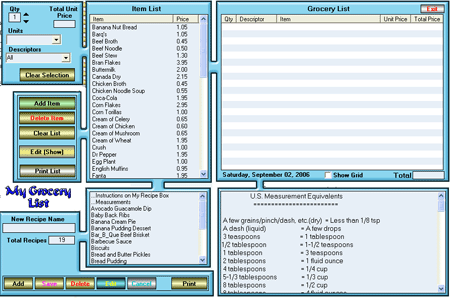



## Grocery List \(update\- 2\)

### Description

Creates a grocery list and also store your recipes. Can print out both. You might find a couple of little gems here that you can use. Mostly how to make a simple project complex.
 
### More Info
 

             |
---                |---
**Submitted On**   |2006-09-07 19:24:18
**By**             |[Kenneth Foster](https://github.com/Planet-Source-Code/PSCIndex/blob/master/ByAuthor/kenneth-foster.md)
**Level**          |Intermediate
**User Rating**    |5.0 (35 globes from 7 users)
**Compatibility**  |VB 6\.0
**Category**       |[Complete Applications](https://github.com/Planet-Source-Code/PSCIndex/blob/master/ByCategory/complete-applications__1-27.md)
**World**          |[Visual Basic](https://github.com/Planet-Source-Code/PSCIndex/blob/master/ByWorld/visual-basic.md)
**Archive File**   |[Grocery\_Li201855972006\.zip](https://github.com/Planet-Source-Code/kenneth-foster-grocery-list-update-2__1-66446/archive/master.zip)

